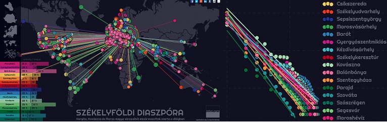

[  székelydata](http://csaladenes.egologo.ro/)
========
  

  
Ez a kódtár mappákba rendezve tartalmaz mindent amire szükséged lehet, hogy reprodukáld a bejegyzésekben beumutatottakat. 
Látogasd meg a blogot [itt](http://csaladenes.egologo.ro/). 
A munkamenet általában a következő:
  - [Jupyter](http://jupyter.org)-ben [python](http://python.org) és [pandas](http://pandas.pydata.org) segítségével letöltjük és formázzuk az adatokat. Ehhez ez _.ipynb_ kiterjesztésű fájlt keressél a mappában.
  - _Pandas_-al az adatokat [JSON](http://json.org) formátumba mentjük. Egy vagy több _.json_ kiterjesztésű fájlt fogsz találni.
  - A _JSON_ fájlokból [D3](http://d3js.org) illetve [D3plus](http://d3plus.org) segítségével adatvizualizációt építünk. A végső terméket [HTML](https://www.w3schools.com/html/default.asp)-el és [CSS](https://www.w3schools.com/html/html_css.asp)-el formázzuk. A mappában  találsz majd egy _index.html_ fájlt, és más _.html_ kiterjesztésű fájlokat is. Speciális projketek esetében különálló _.css_ és _.js_ ([Javascript](https://www.javascript.com/)) fájlokat is készítünk. Az adatvizualizációk grafikus motorjai az [SVG](https://www.w3schools.com/html/html5_svg.asp) és (ritkábban) a [Canvas](https://www.w3schools.com/html/html5_canvas.asp) formátumok.
  
Ezen a __GitHub__ webhelyen egy-egy önálló adatvizualizáció és hozzá tartozó blogbejegyzés megnevezése a _projekt_. 

- Az __[Issues](https://github.com/csaladenes/szekelydata/issues)__ oldalon találod a jelenlegi általános fejlesztéseket, illetve a már létező projektekhez befejezéséhez szükséges infomációkat és tennivalókat, címkék szerint rendezve. Maga a _SZÉKELYDATA iniciatíva_ is egy projektként szerepel, ami magában foglalja a blogot, a webes és közösségi média jelenlétet, illetve Székelyföld jövőjével kapcsolatos ötleteket. 
- A __[Projects](https://github.com/csaladenes/szekelydata/projects)__ oldalon találod a jelenleg kutatás-fejlesztés alatt álló projektetket. Nevükre kattintva a részletes projekt-struktúrákat, illetve a tervezett, folyamatban levő és elvégzett feladatokat is megtekinteheted. 
- A __[Wiki](https://github.com/csaladenes/szekelydata/wiki)__ oldalon megtalálod, hogyan járulhatsz hozzá a folyamatban levő projektekhez, illetve hogyan javasolhatsz újakat. Ugyanitt részletes támogatási infókat is találsz. 
- Számos projekt csak az odaadó __SZÉKELYDATA__ követők önkéntes munkájával valósulhat meg - amolyan __digitális kaláka__ (crowdsourcing) keretében. Adományozhatsz az idődből _kódolási_, _adatbeviteli_ és _ellenőrzési_ munkák elvégzésére. Ugyanakkor a székelyföldi _terepmunkában_ is nagy segítség lehetsz.

Látogasd meg a __[SZÉKELYDATA](http://szekelydata.csaladen.es)__ blogot.  
Az SZÉKELYDATÁ-hoz hasonló, angol nyelvű adatvizualizációs blogot itt találod: __[Try something new . Everyday.](http://blog.csaladen.es)__  
Személyes weboldalam itt találod: __[csaladen.es](http://csaladen.es)__
  
Még több adatvarázslatért, kérlek __támogasd__ a munkámat:
  - __[Patreon](https://www.patreon.com/szekelydata)__
  - __[Paypal](https://www.paypal.com/cgi-bin/webscr?cmd=_s-xclick&hosted_button_id=LDXE7C6W7S85N)__
  
   
#   
Csala Dénes, 2017  
http://csaladen.es

## 💫 Stars over time

